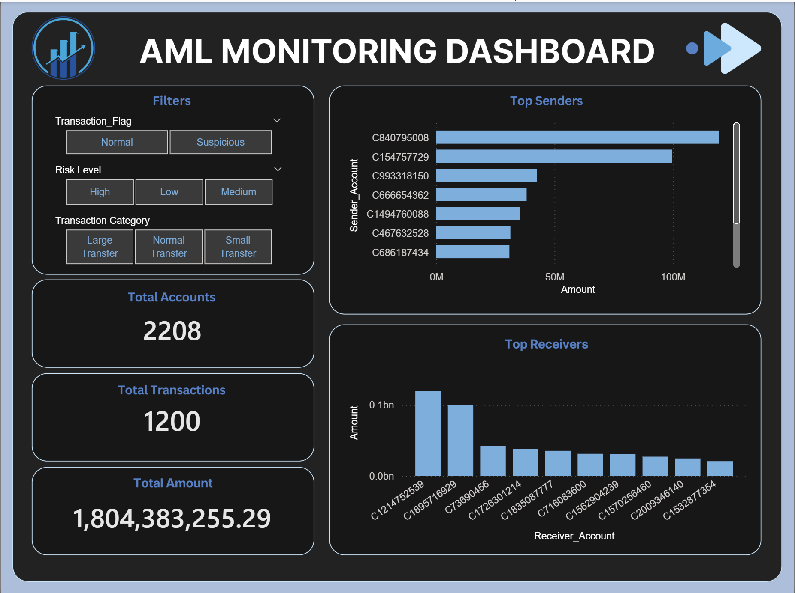
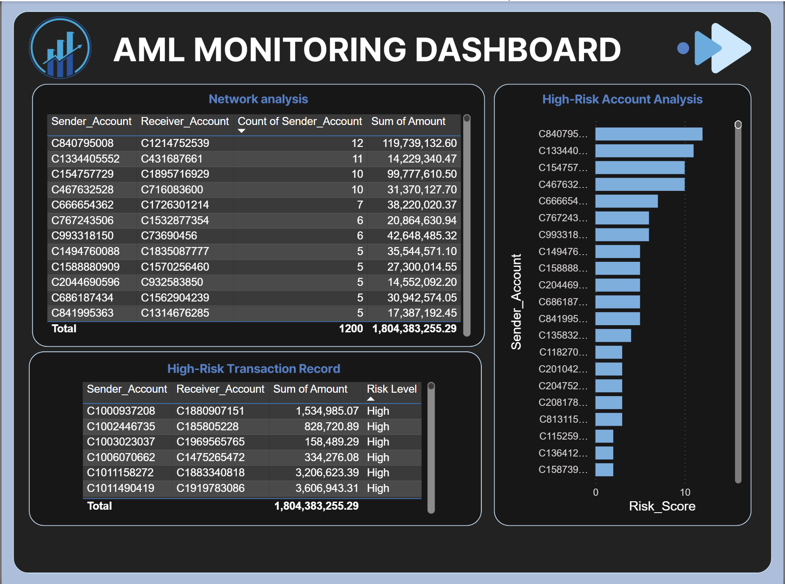

# AML-Monitoring-Dashboard

## Project Overview
Interactive Power BI dashboard for analyzing financial transactions, monitoring risk patterns, and identifying suspicious activities related to fraud and Anti-Money Laundering (AML).

## Tools
- Power BI
- Power Query
- DAX
- Excel

## Data Processing
- Data cleaning and transformation using Power Query
- Created calculated measures using DAX
- Prepared data model for financial transaction analysis

## KPIs
- Total Transactions
- Total Transaction Amount
- Total Accounts
- Suspicious Transactions
- Risk Level Distribution

## Dashboard Features
- Transaction Overview
- Fraud Analysis
- Risk Distribution
- Geographic Transaction Analysis
- Top Senders and Receivers
- High-Risk Account Identification

## Dataset
Synthetic Financial Datasets For Fraud Detection

## Dashboard Preview

